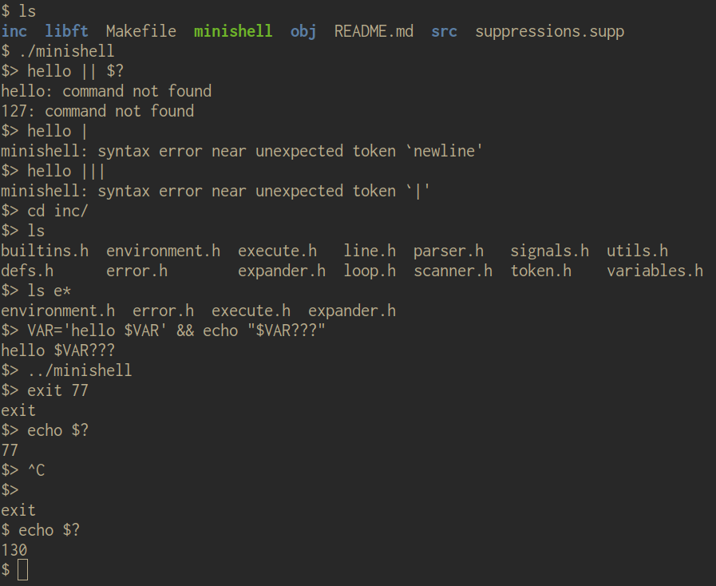

# minishell
 

     

> **What this is:** A small Unix shell\
> **Context:** A 42 school project\
> **Dev time:** several months\
> **Team size:** 2\
> **Role:** project lead



## Usage

```bash
make
./minishell
```

## Overview

- ~6,500 lines of C, including our partially-implemented `libc`
- Builtins: `echo -n`, `cd`, `pwd`, `export`, `unset`, `env`, `exit`
- Pipe chains `a | b | c`
- Redirections with `<`, `>`, `>>` and heredocs
- Expansion of `$VAR` and `$?`, with quote semantics (`'` and `"`)
- Signals handled per context (prompt, heredoc, child process)
- Invalid input is rejected with an error naming the first offending token
- External commands resolved via `PATH` and relative paths
- Integrated readline prompt with history
- Bonus: glob expansion for `*`
- Bonus: `&&` and `||` with bash precedence and `()` for grouping

## Architecture

    input -> scanner -> token validator -> parser -> expander -> executor

## Coding standard

Written to the 42 Norm (no more than 25 lines per function, no more than 80 characters per line).
